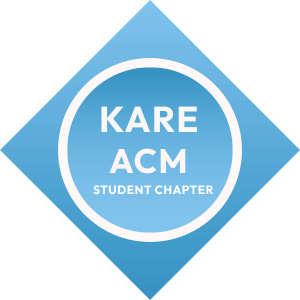

<p align="center">
  
</p>

<h1 align="center">ACM KARE Student Chapter Website</h1>

<p align="center">
  Welcome to the official repository of the <b>ACM KARE Student Chapter</b> website (Kalasalingam Academy of Research and Education). This platform highlights our technical events, research blogs, team achievements, and our vibrant developer community.
</p>

---

## 🚀 Key Features

* **3D Interactive Event Cards**: Visually stunning holographic cards built with CSS and React.
* **Premium Dark Theme**: Sleek dark-mode aesthetic designed with HSL-tailored colors and glassmorphism.
* **Ultra-Responsive UI**: Fully optimized layout for mobile, tablet, and desktop screens with smooth micro-interactions.
* **Modern Animation**: High-performance animations powered by **GSAP** and **Framer Motion**.
* **Clean Architecture**: Built on top of **React 18**, **Vite**, **TypeScript**, and **Shadcn UI**.

---

## 🛠️ Tech Stack

* **Frontend**: [React 18](https://react.dev/) + [TypeScript](https://www.typescriptlang.org/)
* **Build Tool**: [Vite](https://vitejs.dev/)
* **Styling**: [Tailwind CSS](https://tailwindcss.com/) + [Shadcn UI](https://ui.shadcn.com/)
* **Animations**: [Framer Motion](https://www.framer.com/motion/) & [GSAP](https://gsap.com/)
* **Icons**: [Lucide React](https://lucide.dev/)

---

## 💻 Getting Started

### Prerequisites

Ensure you have [Node.js](https://nodejs.org/) installed on your machine.

### Installation

1. **Clone the repository:**
   ```bash
   git clone <repository-url>
   cd <repository-directory>
   ```

2. **Install dependencies:**
   ```bash
   npm install
   ```

3. **Start the development server:**
   ```bash
   npm run dev
   ```

4. **Build for production:**
   ```bash
   npm run build
   ```

---

## 📂 Project Structure

* `/src/components` - Reusable UI components.
* `/src/pages` - Pages like Home, Events, Blogs, and Team.
* `/src/index.css` - Global styling and theme token system.
* `/public` - Static assets including images, icons, and logo marks.

---

## 👥 Contributing

We welcome contributions! Please fork the repository and submit a pull request with your suggested improvements.

---

<p align="center">
  Developed with ❤️ by <b>KARE ACM</b>
</p>

